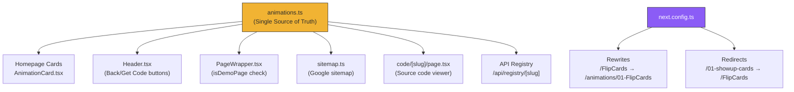

# URL Shortener — Full Walkthrough

This document explains **every change** we made to shorten the TweenLabs URLs, step by step, in simple English.

---

## What Changed (Before → After)

| What | Before | After |
|---|---|---|
| **Demo URL** | `tweenlabs.xyz/01-showup-cards` | `tweenlabs.xyz/FlipCards` |
| **Code URL** | `tweenlabs.xyz/code/01-showup-cards` | `tweenlabs.xyz/code/FlipCards` |
| **Folder location** | `src/app/01-showup-cards/` | `src/app/animations/01-FlipCards/` |
| **Route in data** | `/01-showup-cards` | `/FlipCards` |

---

## Why Did We Do This?

1. **Cleaner URLs** — `/FlipCards` is shorter and more memorable than `/01-showup-cards`
2. **Import-friendly** — The URL matches the component name users will import (`FlipCards.tsx`)
3. **Organized folders** — All 18 animations live inside one `animations/` folder instead of cluttering `src/app/`
4. **Numbered for developers** — Folders have number prefixes (`01-FlipCards`) so you can find them easily

---

## How It Works (The Big Picture)

```
User visits: tweenlabs.xyz/FlipCards
                    │
                    ▼
        next.config.ts REWRITE
        Maps /FlipCards → /animations/01-FlipCards
                    │
                    ▼
        Next.js serves the page from:
        src/app/animations/01-FlipCards/page.tsx
```

The **rewrite** is invisible to the user — their browser still shows `/FlipCards` in the address bar, but behind the scenes Next.js loads the file from the `animations/01-FlipCards/` folder.

---

## Current Folder Structure

```
src/app/animations/
├── 01-FlipCards/
│   ├── page.tsx
│   ├── layout.tsx
│   └── HOW_TO_USE.md
├── 02-Carousel3D/
├── 03-SkillFit/
├── 04-PageTransition/
├── 05-HorizontalCards/
├── 06-CircularScatter/
├── 07-FluidCursor/
├── 08-Blueprint/
├── 09-ScrollCards/
├── 10-ScrollTags/
├── 11-OrbitGallery/
├── 12-GravityDrop/
├── 13-StringLine/
├── 14-BorderReveal/
├── 15-KineticText/
├── 16-MagneticDock/
├── 17-BentoGrid/
└── 18-Accordion/
```

---

## The animations.ts Data File

This is the **single source of truth** for all animation data. Every other file reads from this.

**File:** `src/data/animations.ts`

### The Interface

```ts
export interface AnimationItem {
  id: string;            // "01", "02", etc. — just for display/ordering
  name: string;          // "Flip Cards" — human-readable name shown on cards
  componentName: string; // "FlipCards" — used in URL, imports, file naming
  folderName: string;    // "01-FlipCards" — actual folder name on disk
  route: string;         // "/FlipCards" — the short URL path users see
  bgColor: string;       // CSS class for card background color
  textColor: string;     // CSS class for card text color
  description: string;   // Description shown on homepage cards
  tiltClass: string;     // CSS class for card tilt effect
}
```

### Example Entry

```ts
{
  id: "01",
  name: "Flip Cards",
  componentName: "FlipCards",
  folderName: "01-FlipCards",
  route: "/FlipCards",
  bgColor: "bg-wtf-green",
  textColor: "text-white",
  description: "Interactive fanning cards and scroll-pinned cards flipping in 3D perspective space.",
  tiltClass: "tilt-left",
},
```

### What each field is used for:

| Field | Where It's Used | Example |
|---|---|---|
| `name` | Homepage card title, SEO metadata | "Flip Cards" |
| `componentName` | URL slug, code page slug, API response, download file name | "FlipCards" |
| `folderName` | Reading files from disk (`page.tsx`, `HOW_TO_USE.md`) | "01-FlipCards" |
| `route` | Browser URL, `usePathname()` matching, sitemap | "/FlipCards" |

---

## The next.config.ts File

This file has **two maps** and **two async functions**:

**File:** `next.config.ts`

### Map 1: `oldToNew` — SEO Redirects

Maps old URL slugs to new component names. Used by `redirects()`.

```ts
const oldToNew: Record<string, string> = {
  "01-showup-cards": "FlipCards",
  "02-3d-carousel": "Carousel3D",
  // ... all 18 old slugs
};
```

**What it does:** When someone visits the old URL `/01-showup-cards`, the browser is permanently redirected (301) to `/FlipCards`. This tells Google to transfer all SEO ranking to the new URL.

### Map 2: `componentToFolder` — URL Rewrites

Maps component names to numbered folder names. Used by `rewrites()`.

```ts
const componentToFolder: Record<string, string> = {
  FlipCards: "01-FlipCards",
  Carousel3D: "02-Carousel3D",
  // ... all 18 components
};
```

**What it does:** When someone visits `/FlipCards`, Next.js invisibly serves the page from `src/app/animations/01-FlipCards/page.tsx`. The browser still shows `/FlipCards`.

### The Two Functions

```ts
// REDIRECTS — for old URLs (SEO protection)
async redirects() {
  const redirects = [];
  for (const [oldSlug, newName] of Object.entries(oldToNew)) {
    // /01-showup-cards → /FlipCards (permanent 301)
    redirects.push({
      source: `/${oldSlug}`,
      destination: `/${newName}`,
      permanent: true,
    });
    // /code/01-showup-cards → /code/FlipCards (permanent 301)
    redirects.push({
      source: `/code/${oldSlug}`,
      destination: `/code/${newName}`,
      permanent: true,
    });
  }
  return redirects;
},

// REWRITES — for short URLs (invisible mapping)
async rewrites() {
  return Object.entries(componentToFolder).map(([name, folder]) => ({
    source: `/${name}`,                    // /FlipCards
    destination: `/animations/${folder}`,  // /animations/01-FlipCards
  }));
},
```

> **Rewrites** = invisible (browser shows `/FlipCards`, serves from `/animations/01-FlipCards`)
> **Redirects** = visible (browser changes URL from `/01-showup-cards` to `/FlipCards`)

---

## Files That Use `componentName`

These files match the URL slug against `anim.componentName`:

### Header.tsx

Builds the "Get Code" button URL:

```ts
const handleGetCode = () => {
  if (!currentAnim) return;
  const codeUrl = `/code/${currentAnim.componentName}`;  // → "/code/FlipCards"
  // ...
};
```

Finds animation on code pages:

```ts
const codeAnim = codeSlug
  ? animations.find((anim) => anim.componentName === codeSlug)
  : null;
```

### AnimationCard.tsx

Builds the "Get Code" link:

```ts
const targetUrl = `/code/${anim.componentName}`;  // → "/code/FlipCards"
```

Uses the shared type (not a duplicate):

```ts
import type { AnimationItem } from "@/data/animations";
```

### sitemap.ts

Generates Google sitemap with short URLs:

```ts
const codeRoutes = animations.map((anim) => ({
  url: `${baseUrl}/code/${anim.componentName}`,  // → "tweenlabs.xyz/code/FlipCards"
}));
```

### code/[slug]/page.tsx

Matches slug to animation:

```ts
const anim = animations.find((a) => a.componentName === slug);
```

Generates static params:

```ts
return animations.map((anim) => ({
  slug: anim.componentName,  // "FlipCards", "Carousel3D", etc.
}));
```

---

## Files That Use `folderName`

These files read actual files from disk, so they need the numbered folder name:

### code/[slug]/page.tsx

```ts
const animationsDir = path.join(process.cwd(), "src", "app", "animations");
const pagePath = path.join(animationsDir, anim.folderName, "page.tsx");
// → "src/app/animations/01-FlipCards/page.tsx"
const howToUsePath = path.join(animationsDir, anim.folderName, "HOW_TO_USE.md");
// → "src/app/animations/01-FlipCards/HOW_TO_USE.md"
```

### API Registry route.ts

```ts
const animationsDir = path.join(process.cwd(), "src", "app", "animations");
const pagePath = path.join(animationsDir, anim.folderName, "page.tsx");
// → "src/app/animations/01-FlipCards/page.tsx"
```

---

## How `usePathname()` Works With Rewrites

You might wonder: "If the file is at `/animations/01-FlipCards`, won't `usePathname()` return `/animations/01-FlipCards`?"

**No.** With Next.js rewrites, `usePathname()` returns what the **user sees in their browser** — which is `/FlipCards`. This is exactly what we store in `anim.route`.

```ts
// User visits: tweenlabs.xyz/FlipCards
// usePathname() returns: "/FlipCards"
// anim.route is: "/FlipCards"
// ✅ They match!

const isDemoPage = animations.some((anim) => anim.route === normalizedPath);
```

---

## Adding a New Component (Checklist)

When you create animation `#19`, you need to touch **3 places**:

### 1. Create the folder

```
src/app/animations/19-NewComponent/
├── page.tsx          ← Your animation code
├── layout.tsx        ← SEO metadata + JSON-LD
└── HOW_TO_USE.md     ← Setup guide shown on /code page
```

### 2. Add entry in `animations.ts`

```ts
{
  id: "19",
  name: "New Component",
  componentName: "NewComponent",
  folderName: "19-NewComponent",
  route: "/NewComponent",
  bgColor: "bg-wtf-green",
  textColor: "text-white",
  description: "Description of the animation.",
  tiltClass: "tilt-left",
},
```

### 3. Add to `next.config.ts` → `componentToFolder`

```ts
const componentToFolder: Record<string, string> = {
  // ... existing entries
  NewComponent: "19-NewComponent",  // ← Add this line
};
```

> **Note:** You do NOT need to add anything to `oldToNew`. That map is only for the old URLs that were already indexed by Google. New components never had old URLs.

---

## Data Flow Diagram



---

## Quick Reference Table

| # | Folder Name | Component Name | URL | Old URL (redirected) |
|---|---|---|---|---|
| 01 | 01-FlipCards | FlipCards | /FlipCards | /01-showup-cards |
| 02 | 02-Carousel3D | Carousel3D | /Carousel3D | /02-3d-carousel |
| 03 | 03-SkillFit | SkillFit | /SkillFit | /03-screen-skill-fit |
| 04 | 04-PageTransition | PageTransition | /PageTransition | /04-page-change-animation |
| 05 | 05-HorizontalCards | HorizontalCards | /HorizontalCards | /05-horizontal-cards-showcase |
| 06 | 06-CircularScatter | CircularScatter | /CircularScatter | /06-circular-scatter |
| 07 | 07-FluidCursor | FluidCursor | /FluidCursor | /07-fluid-cursor |
| 08 | 08-Blueprint | Blueprint | /Blueprint | /08-blueprint-scatter |
| 09 | 09-ScrollCards | ScrollCards | /ScrollCards | /09-scroll-cards-01 |
| 10 | 10-ScrollTags | ScrollTags | /ScrollTags | /10-scroll-tags-assembly |
| 11 | 11-OrbitGallery | OrbitGallery | /OrbitGallery | /11-scroll-orbit-gallery |
| 12 | 12-GravityDrop | GravityDrop | /GravityDrop | /12-gravity-drop |
| 13 | 13-StringLine | StringLine | /StringLine | /13-string-line |
| 14 | 14-BorderReveal | BorderReveal | /BorderReveal | /14-inward-outward-border-reveal |
| 15 | 15-KineticText | KineticText | /KineticText | /15-kinetic-typography |
| 16 | 16-MagneticDock | MagneticDock | /MagneticDock | /16-magnetic-dock |
| 17 | 17-BentoGrid | BentoGrid | /BentoGrid | /17-bento-grid-flip |
| 18 | 18-Accordion | Accordion | /Accordion | /18-morphing-accordion |
